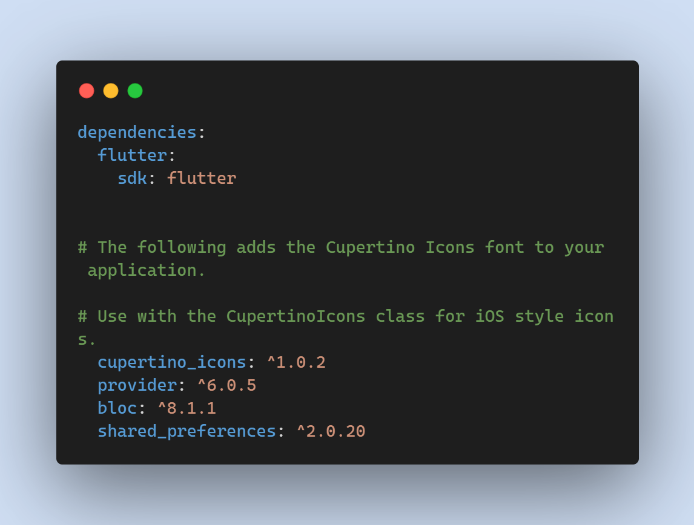

# (22) Storage

## Summaries

### Shared Preference

Shared Preference merupkan flutter plugin yang berfungsi untuk menyimpan dan mengambil data primitif dalam jumlah kecil sebagai _key-value_ pair ke file di penyimpanan perangkat seperti String, integer, float, Boolean yang membentuk preferensi dalam file XML di dalam aplikasi pada penyimpanan perangkat. Di Android dan iOS. SharedPreferences di flutter menggunakan `NSUserDefaultson` iOS dan `SharedPreferences` di Android, menyediakan penyimpanan persisten untuk data sederhana. Misalnya kasus pada menyimpan nama pengguna dan status login di shared_preferences. Dalam Aplikasi Android pertimbangkan kasus ketika pengguna masuk atau tidak, kita dapat menyimpan status login-logout di shared_preferences, sehingga pengguna tidak perlu menulis kata sandi, lagi dan lagi, kita dapat menyimpan status login di bool variabel itu adalah sejumlah kecil data tidak perlu di input pada database, dan hanya dapat menyimpannya di shared_preferences untuk mengaksesnya dengan cepat. Untuk menggunakan plugin ini tersedia ada [pub package flutter](https://pub.dev/packages/shared_preferences) yang disediakan.

Lalu tambahkan pada file `pubspec.yaml` dengan tambahan plugin di baris dependencies.
```
shared_preferences: ^2.0.20
```


### SQLite

Jika mendevelop sebuah aplikasi yang perlu menyimpan/meminta data jumlah skala yang besar di perangkat lokal, usahakan untuk menggunakan database, bukan lagi menggunkan file lokal atau penyimpanan _key-value_. Secara umum, database menyediakan _inserts_, _updates_, dan men-queries data. Pada Aplikasi Flutter ini dapat menggunakan database SQLite melalui plugin [sqflite](https://pub.dev/packages/sqflite) yang tersedia di pub.dev. plugin ini menunjukkan dasar-dasar penggunaan pada SQL seperti _insert_, _read_, _update_, dan _remove_ data.

### 